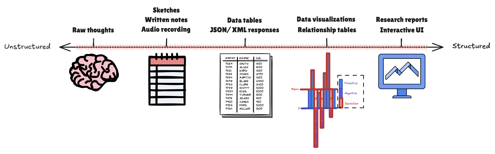
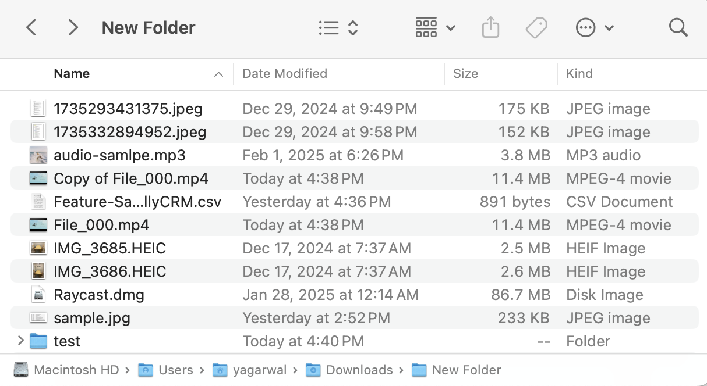
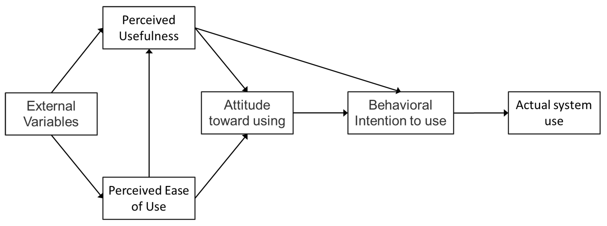

#### Table of contents
{: .no_toc }

1. TOC
{:toc}

---

# Important Conclusions
[February 2025]()

- Data ranges from being unstructured (raw) to structured (well categorized). The more structure it has, the more useful it is. The process of structuring data requires data collection → cleaning → labeling → semantic understanding → classification → output transformation. **There's economic value to be created from making data structured**. Here's the data spectrum:

- **File organization suck today**. They're unorganized. Their names are ugly. Average professional has 2TB+ accessible data which can never be found when needed. Expecting employees to organize files in neat folders with no duplicates is a pipe dream. Employees annualy lose weeks of productivity and gain 20+ points of blood pressure trying to find the right files & browsing unorganized desktops and downloads. No search tool can operate on this mess:

- People are lazy. They don't like to change. They spend 95% time on existing habits & 5% time trying new things. An average worker can reduce ~2 hrs of wasted time through 10 mins of daily planning. **Products need to be easy to adopt**: sit in existing workflows, require 0-1 clicks to prove initial value, be non-intrusive & just show up when relevant without manual effort. Currently system use has many dependencies on external variables, user's attitude, intentions, perceived ease of use & usefulness.

---

# Birthday post
[February 2025]()

I’ve never been more excited to be alive. With the knowledge I’ve gained in US & the grit I’ve gained in India I feel dangerous. I sense so many problems in the world which I would love to spend my entire life solving. Last few years, I’ve been fortunate to deploy technology to millions & build reliable AI products at the heart of innovation in Silicon Valley. I know I’m capable of lovingly building these products: AI that makes businesses feel easy, applications that you want to open every day, APIs to make integrations a layman skill. I like to think I have the discipline & all that it takes, but time will tell as I’m tested on this new journey. I will build something meaningful. Hopefully something that spans beyond my time. Hopefully something I enjoy pursuing every waking moment. Hopefully something that makes people happier. But definitely something awesome that I will use, build in my style, & come from a place of deep love & gratitude for the world. I turn 25 tomorrow, the year I become HIM.

---

# Kuch Bada Karna Hai
[January 2025]()

Har roz sone se pehle lagta hai ki, bc zindagi mein kuch ukhada nahin hai. Duniya se ghar, parivar, padhai, dost, zaroorat jitne paise milne ke baad bhi kuch kami lagti hai. 

Shayad do cheezon ki kami hai.

Ek kuch bada karne ki. Kuch aesa jo mere close logon ki madad to kare hi but puri duniya ko ek behtareen aur beautiful jaga bana de, shayad thode mere hi style mein.

Doosri long term finances ki. Even simple needs ke saath, ek certain family lifestyle aur mental freedom ke liye finances important hai. But agle 20 years mein kitne finances ki zaroort hai define karna chahiye.  

Duniya puchti rehti hai "ab kya plans hai?" – but apna koi immediate answer pasand nahin aata. Kuch bada karne ke plan mein clarity chahiye.

---

# Farewell Reflection
[December 2024]()

My thoughts on leaving Moveworks:

Honestly, I’ve thought about moving back to India with my family for many years. But yesterday as I thought about this farewell, I was overcome with emotions.

For last 3 years, working here has formed my identity:
- Leading projects that intrigue me with people I respect has fully immersed me.
- New friends I’ve made are from work, even found brothers in the process.

This job has presented me with some of the hardest personal / professional challenges I’ve had to navigate: feeling undervalued for my contributions, aligning tough stakeholders, enabling large teams that won’t read your docs, and building a product as innovative and complex as creator studio: sometimes I’ve missed requirements. Sometimes my decisions caused millions in escalations. Sometimes I've lost emotional control.

Maybe this was an important ‘trial by fire.’ From being scared to speak up in meetings, and constantly feeling under confident in my ideas, I’ve grown to be a person I can respect in many ways. Someone who truly believes in himself and is hungrier than ever to leave a mark on the world. I can’t see another way I would have grown similarly.

The new chapter brings uncertainty. I don't know if I'll find another meaningful purpose. I don't know if startup plans will manifest. But I leave feeling blessed with the growth so far and optimistic about what's to come.

---

# Therapy
[September 2024]()

Today was my last therapy session ... 

## Why I started therapy

Before discussing my experience, let me note why I started therapy. A few months ago, I sought professional help as I felt just lost in life. I was living away from family, friends and the city – often feeling alone after work. I'd gone through a break up many months ago but the feelings seemed to accentuate more recently. I was spending long hours at work without knowing where my career was headed either.

It was uncomfortable facing myself at home – I didn't want to acknowledge how I was feeling and preferred just distracting myself with instagram or playing chess online or dating apps that didn't go anywhere. Some weekends, I'd just go to the office as a getaway from my emotions.

Things weren't always like this. Generally, I pride myself of having good habits, but back then I felt drained in this uncertainity cycle for several weeks. I wasn't waking up early and working out inconsistently. Even personal goals of getting into a good MBA program and building side projects that could become potential companies weren't being worked on enough to become a reality.

I was tried of feeling dissapointed and wanted to change something. I tried discussing my situation with friends and family but feedback wasn't specific enough to trigger any behavioral changes. So, I looked to therapy.

## Logistics

Thank you insurance – I had Cigna HDHP with the Employee Assistance Program (EAP). This got me 3 free sessions followed by 20% co-pay for remaining sessions (amouting to 22.50$ / session). Each session was an hour long every other week. This felt reasonable to me, so I picked a therapist based on online reviews and scheduled a call with them.

## Session takeaways

The following was the flow of sessions:

- **Session 1 – Introduction**
- **Session 2 – Cutting distractions and vices**
- **Session 3 – How to work towards goals**
- **Session 4 – Tips to study for GMAT**
- **Session 5 – Fitting in socially**
- **Session 6 – Coping emotionally**
- **Session 7 – Discussing good vibes**
- **Session 8 – Closing remarks**

Discussions made me realize core frustration came from unfulfilling habits and settings personal goals that I wasn't meeting. I received practical advise and someone who was holding me accountable on new habits I was to adopt. Some weeks were so good that I couldn't think of anything to get additional help about. A small win was also giving my GMAT exam during this period in good headspace and achieving a satisafactory score.

In my opinion, the best way to describe a therapist is a 'professional mental trainer' – a specialist who reserves time to understand you and provide measured ways to improve your thinking and behaviors. Socially, sometimes getting a therapist is interpreted as indicating core flaws in your behavior or traumas. But it takes courage to admit to yourself that you need to improve mentally. It takes even more courage to act on it. I'm happy I signed up and would argue that everyone can use a bit of mental training. 

---

# The beach problem
[July 2024]()

I don’t know exactly what, \
but something is unsettling:
- ⁠Maybe my weight buried in sand,
- ⁠Maybe the sun blinding my eyes,
- ⁠Maybe the lack of self-belief, that I’m just not THAT guy.

As I lay under the sun, \
I wish for strength to swim, \
So far far away, \
To discover new fruits & red dolphins.

If I were to make it, \
I promise to sing for all the fish, \
Hug the dying forests, \
Spread all the love I can give.

Who made me dream of this? \
It feel so noble & divine, \
It’s like I was given life, \
To keep swimming by design.

All fallen leaves would be buried, \
Each living being acknowledged, \
I’ll recite poetry for their souls, \
& humor for their knowledge.

I shouldn’t get so down \
When the world is so vast, \
The sand & sun create new horizons, \
With the right perspective.

---

# Growth at work
[July 2024]()

Maybe there’s something to be learned from it or maybe expressing will help me feel better … but here's my current perspective about work.

This job has presented me with some of the hardest personal / professional challenges I’ve had to navigate: work is intense, takes up mental space when I’m trying to sleep & I frequently find myself feeling “not enough” & under appreciated.

I’m unsure if growth is always preceded by pain — but in many ways the desire to feel better helps me grow / make changes:
- I am learning to not rely on external validation for my work I believe is good
- When I make bad judgements, I am trying to own them without being harsh on myself
- I’m trying to set & communicate a working pace I can maintain
- I’m respecting my sleep & health more

There is a long way to go. While mental health issues & work challenges seem like personal battles, they don’t have to be. I reached out to my family / peers / manager & they were genuine — they listened, they clarified responsibilities, they shared their experiences & I don’t think I’d feel better without their support.

---

# Wellness retro
[June 2024]()

## How am I doing?
{: .no_toc }

This marks a low point in life. 24 & doing “well” on paper (well-educated with a well-paying job) but I feel lost & disappointed in myself. Last many months: 

- Phone usage has spiked up. Averaging 4+ hrs/day. Nothing productive: social media & mindless gaming. Frequent use before & after bed.
- Sleep quality has worsened. Waking up past 8, tired all the time & getting to work groggy.
- Diet?? Eating whatever makes me happy. The number of times I’ve visited the kitchen to snack — even while writing this — is embarrassing. Really let go here.
- Working out has become inconsistent. 1-2 days a week. Low effort & motivation.

I don’t feel out of shape yet but my body & mind are far from healthy. Clear indicators are accelerated hair loss, back problems resurfacing after years, shortness of breath during runs, instant irritation during disagreements (more often than instant empathy). Professionally too, I’m unclear about my goals & inconsistent with my efforts.

**I’m not actually doing “well”.**

## What does it mean to do “well”?
{: .no_toc }

Doing “well” for me has had many meanings. Sometimes it has meant setting specific goals (X type of college, Y type of job, Z type of mastery), sometimes it has meant just doing good deeds (passing a smile, helping a stranger, speaking softer, letting a loved one know how much they’re loved). The anti-version of it has also meant persevering through pain (dealing with heartbreak, failing an exam, fighting a loved one).

It’s not binary (not “well” or “unwell”). It’s a range. Think of it as a master attribute that represents the sum of every factor affecting you.

I envision a “100% well” person: this person excels at all of the above, is great to talk to, has the utmost integrity & channels a character that truly resembles him. No internal conflicts, external judgments, or hardships can break him. He might experience negative emotions but he doesn't let them consume him. He accepts them, same for positive experiences.

“Well” for me is a behavior that encompasses growth, integrity & character:

- Growth = Are you improving as a person over time?
- Integrity = Are you being honest with yourself?
- Character = Are you distinctly being yourself?

“Well” may have a broader or more specific meaning in your life, but I believe everyone wants to do well in their understanding of it.

**I’ve been lacking across my “well” fronts & I’m hoping to get better.** 

## How will I achieve “wellness”?
{: .no_toc }

Well, writing what “well” means for me is a start. The self-reflection here is *growth*. This journal of my raw feelings is an attempt at *integrity*. The try-hard humor underlying a semi-serious message is *characteristic* of me.

I don’t have a long-term game plan to get better … yet. I have a sleep schedule & workout routine in mind for tomorrow. I have a drive to be more intentional at work. Maybe it was wisdom imparted to me during my upbringing (shoutout Dad) but I’m not the kind to expect results on day 1. I know I won’t be 100% well by tomorrow.

**I have a few immediate tactics for “wellness” but it’s an ongoing journey that I’m game for.**

---

{: .important-title }
> <form action="https://formspree.io/f/xldeobvz" method="POST">
>   <label>
>     <input type="email" name="email" placeholder="email here ...">
>   </label>
>   <button type="submit">Subscribe</button>
> </form>